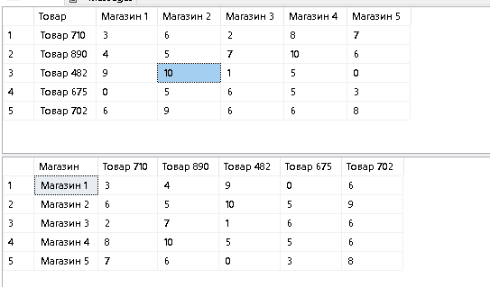

## Результат выполнения тестового задания в среде MS SQL Server
2022-09-27

Задача:
Для таблицы произвольной размерности (по колонкам и строкам) написать скрипт, результатом которого будет вывод в табличном виде транспонированного содержания исходной таблицы без использования штатной функции PIVOT.

В качестве решения, будем использовать другую штатную возможность **MS SQL Server** - [создание SQL Statament в виде текста и запуск получившегося скрипта.](https://www.mssqltips.com/sqlservertip/1160/execute-dynamic-sql-commands-in-sql-server/)

Решение:

1) Создаем пустую базу данных.
```sql
-- Создаем базу данных
Create database CheeseDb
go
use CheeseDb
go
```

2) Формиурем структуры двух таблиц: SourcTable, ResultTable 
```sql
-- Создаем исходную таблицу
Declare @sql varchar(max) = 'Create table SourceTable ([Товар] varchar(255), '
Declare @currentPosition bigint = 1
Declare @maxPosition bigint = 5


While(@currentPosition <= @maxPosition)
Begin
	Set @sql = @sql  + '[Магазин ' + CAST(@currentPosition as varchar(50)) + '] bigint,'
	Set @currentPosition  = @currentPosition + 1
End

Set @sql = Substring(@sql,1, Len(@sql) - 1 ) + ')'
Exec(@sql)

-- Заполняем данными исходную таблицу
Set @currentPosition = 1


Declare @sqlInsertHeader as varchar(max) = 'Insert into SourceTable ([Товар] '
While(@currentPosition <= @maxPosition)
Begin
	Set @sqlInsertHeader = @sqlInsertHeader + ',[Магазин ' + CAST(@currentPosition as varchar(50)) + ']'
	Set @currentPosition  = @currentPosition + 1
End
Set @sqlInsertHeader = @sqlInsertHeader + ')'

Declare @currentRow bigint = 1
While(@currentRow <= @maxPosition)
Begin
    
	Set @currentPosition = 1
	Declare @productName varchar(255) = 'Товар ' +  CAST( floor(RAND() * 1000) as varchar(50))
	Set @sql = 'VALUES(''' +  @productName + ''','
	While(@currentPosition <= @maxPosition)
	Begin
		Set @sql = @sql +  CAST(floor(RAND() * (10 + 1)) as varchar(50)) + ','
		Set @currentPosition  = @currentPosition + 1
	End
	Set @sql = substring(@sql, 1, len(@sql) - 1) + ')'

	Set @currentRow = @currentRow + 1
	Exec (@sqlInsertHeader + @sql)

End

```
Теперь, создаем обратную таблицу - ResultTable

```sql

-- Создаем по аналогии перевернутую таблицу
Set @sql = 'Create table ResultTable ([Магазин] varchar(255), '
Set @currentPosition = 1

DECLARE curProductList
CURSOR
FOR Select [Товар] as ColumnName from SourceTable
DECLARE @columnName varchar(100)
OPEN curProductList

FETCH NEXT FROM curProductList INTO @columnName
WHILE (@@fetch_status <> -1)
BEGIN
	IF (@@fetch_status <> -2)
	BEGIN
				Set @sql = @sql  + '[' + @columnName + '] bigint,'
	END
	FETCH NEXT FROM curProductList INTO @columnName
END

CLOSE curProductList
DEALLOCATE curProductList


Set @sql = substring(@sql, 1, len(@sql) - 1) + ')'
Exec(@sql)

```
3) Переносим данные из одной таблицы в другую. Для переноса в начале создаем строки в таблице ResultTable, а затем командой Update переносим значения.

```sql

-- Переносим данные в таблицу назначение
-- 1) Формируем строки
Set @sql = ''
Set @currentPosition = 1
While(@currentPosition <= @maxPosition)
Begin
	Declare @row as varchar(255) = 'Магазин ' + CAST(@currentPosition as varchar(50))
	Set @sql = 'Insert into ResultTable([Магазин]) Values(''' + @row + ''')'
	Exec(@sql)
	    
	Set @currentPosition  = @currentPosition + 1
End

-- 2) Формируем Update команды для вставки данных 
Set @sql = 1
DECLARE curProductList
CURSOR
FOR Select [Товар] as ColumnName from SourceTable
DECLARE @columnName varchar(100)
OPEN curProductList

FETCH NEXT FROM curProductList INTO @columnName
WHILE (@@fetch_status <> -1)
BEGIN
	IF (@@fetch_status <> -2)
	BEGIN
		
		Set @currentPosition = 1
		While(@currentPosition <= @maxPosition)
		Begin

			Declare @shopName as varchar(255) = 'Магазин ' + CAST(@currentPosition as varchar(50))
			Set @sql = 'Update ResultTable Set [' + @columnName + '] = (Select Top 1 [' + @shopName + '] from SourceTable where [Товар] = ''' + @columnName + ''') where [Магазин] = ''' + @shopName + ''''
			Exec(@sql)
			Set @currentPosition = @currentPosition + 1

		End

	END
	FETCH NEXT FROM curProductList INTO @columnName
END

CLOSE curProductList
DEALLOCATE curProductList
```
4) Результат - см. картинку


### Недостатки:
1) Для создания и переноса данных используется условие, что количество колонок = количеству строк. В реальной задаче, всегда не так.
2) Так же, ставится условие, что товары в исходной таблице SourceTable должны быть уникальны (не проверяются). В реальной задаче, часто это не так. Поэтому, перенос данных (если  названия товаров будут не уникальны) будет не корректно работать.
3) Перенос происходит путем выполнения запроса Update. В качестве дополнительной меры оптимизации можно сформировать команду Insert сразу же с набором данных.

### Ремарка:
Уважаемые коллеги, прошу обратить внимание, что целью данного решения является не сделать как можно лучше, а показать Вам навыки владения T-SQL
**Удачи нам всем!**
